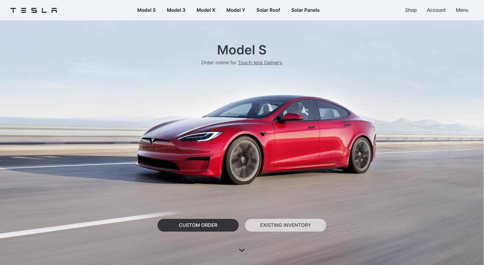

# Tailwind Course on Udemy
This Tesla site is a single page app built with HTML and CSS. This project is used to give a understanding of TailwindCSS. How it differ's from Bootstrap or Material UI. Pros and cons of using it, and how it is used.

I enjoyed the course for sure. Learned a lot for a free course. As of Mar. 14, 2022, this is a free course on Udemy. Take the course yourself or play around with this project template.

https://www.udemy.com/course/complete-tailwind-css-beginner-to-advanced-with-project/

I enjoyed his walk through of how to get up and running with Tailwind. How to install it and the why and what of the scripts to create and run to compile the css. The images supplied here and the favicon are provided by the course instructor of God Bless You. It was pretty short at just an hour of video and 9 shorts articles. Still, I feel better having taken it.